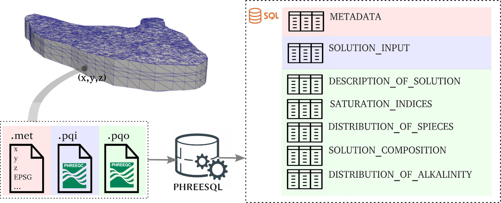
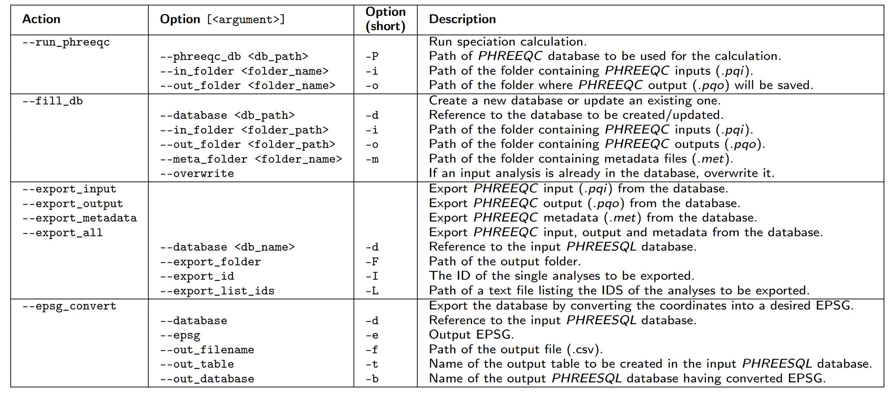

# PHREESQL

PHREESQL is a toolkit for efficiently storing the huge amount of data from geochemical speciation simulations run by PHREEQC in an
SQL database. It includes both a C++ library, namely PHREESQLib, and a command-line interface, namely PHREESQLexe, to ease the usability of PHREESQLib by technical experts
with low programming knowledge. Thanks to its relational data structure, PHREESQL allows to be exploited in third-party packages based on and to re-use them for other analyses by external packages of environmental interest.

## Authors

- Daniela Cabiddu (CNR-IMATI Genova, Italy)
- Marino Vetuschi Zuccolini (DISTAV Genova, Italy)
- Simone Pittaluga (CNR-IMATI Genova, Italy)

## Dependences 
- CMake (https://cmake.org/download);
- SQlite (https://www.sqlite.org/download.html);
- IPhreeQC (included as a submodule in *external*);
- PROJ (included as a submodule in *external*);

## How to get PHREESQL

The repository includes some submodules necessary to make PHREESQL work. Please, clone it recursively:

`git clone --recursive https://github.com/DanielaCabiddu/PHREESQL/`

## How to build (and test)

PHREESQL provides a *build_and_test.sh* script, located in the root directory *ROOT* (where this README lies). 
Simply run it to build the toolkit (together with the dependencies), generate the *PhreeSQLexe* tool and run a preliminary test:

`${ROOT}/build_and_test.sh`

## Case Study
Our case study is described in the paper and exploits the Ireland EPA database (https://gis.epa.ie/GetData/Download). To guarantee replicability, data and source code of our case study is provided in the *example* folder.
If you wish to replicate our case study, please run the *case_study.sh* script located located in the root directory *ROOT* (where this README lies) to create the complete set of PHREESQL databases:

`${ROOT}/case_study.sh`

The PHREESQL databases will be available in the *${ROOT}/example/DB* folder.

To run some examples of database queries and generate plots, please run the *query.sh* script by providing the full database path (<DB_PATH>) of the database to be queried: 

`${ROOT}/query.sh <DB_PATH>`

## Usage

**PHREESQLib** is an header-only C++ library having IPhreeQC and PROJ as mandatory dependences. To exploit PHREESQLib in your C++ project:
- build the external dependence IPhreeQC (*external/iphreeqc*);
- build the external dependence PROJ (*external/proj-osgeo*);
- include PHREESQLib (*phreesqlib folder*) in your project;
- include and link IPhreeQC and PROJ in your project;
- link SQlite in your project.

**PhreeSQLExe** is an example of usage, and provides the possibility to automatically perform speciation calculation and storage starting from a given dataset. The complete set of options is attached here below:

## Citing Us

If you use PhreeSQLib in your academic projects, please consider citing the library using the following BibTeX entry:

[BIBTEX REFERENCE AFTER PUBLICATION]

## Acknowledgments
