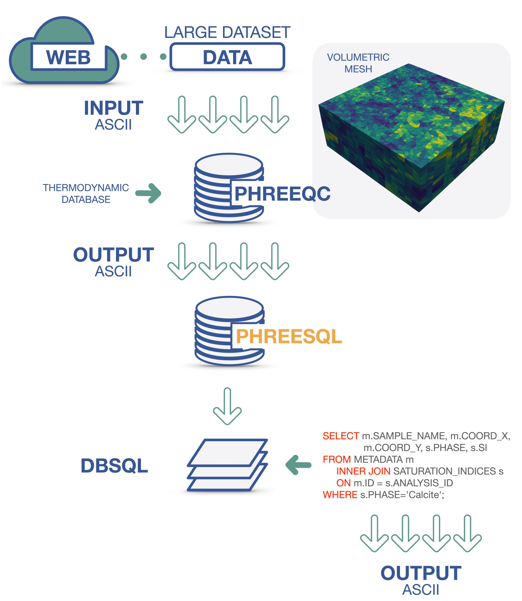

# PHREESQL - a toolkit to efficiently compute and store geochemical speciation calculation

PHREESQL is a toolkit for efficiently storing and managing the huge amount of data coming from geochemical speciation computation run by PHREEQC. High efficiency in data extraction and filtering is guaranteed thanks to an relational SQL database structure. PHREESQL enables the geochemical community to explore the potentiality of huge water chemistry database and the developers to embed the code in application where unstructured meshes are involved or real-time sensors acquire a set of compositional and chemical-physical parameters. PHREESQL includes both a C++ library and a command-line interface to ease the usability of PHREESQL by geochemists with low programming skills.

PHREESQL is an easy-to-use framework supporting PHREEQC speciation calculations only (keyword data block SOLUTION-END), as well as performing storage and query of results. The production of a relational SQL database is the core of that toolkit. The relational database management system (RDBMS) makes it possible to permanently store in a structured framework a very large number of geochemical calculations compacting all data in a SQL binary data.

To guarantee usability by both developers and users with low programming expertise, PHREESQL includes both a C++ library and a command-line interface, namely PHREESQLib and PHREESQLexe respectively. Thus PHREESQL exhibits the following capabilities, being able to:
- run PHREEQC speciation calculation;
- build a SQL database from scratch and to update an existing database with additional data;
- export both original PHREEQC inputs and outputs from an existing database for further processing;
- process coordinates of geo-referenced data into an existing database to create a new table or to create a new database framed into a new specific coordinate reference system (CRS).

## Workflow [IMAGE](https://github.com/DanielaCabiddu/PHREESQL/blob/main/images/phreesql-workflow.png)

<p align="center"></p>

## Clone

The repository includes some submodules necessary to make PHREESQL work. Please, clone it recursively:

`git clone --recursive https://github.com/DanielaCabiddu/PHREESQL/`

## Usage

**PHREESQLib** is an header-only C++ library having some mandatory dependences:

- SQlite (https://www.sqlite.org/download.html);
- IPhreeQC (included as a submodule in *external*);
- PROJ (included as a submodule in *external*);

To exploit PHREESQLib in your C++ project:
- build the external dependence IPhreeQC (*external/iphreeqc*);
- build the external dependence PROJ (*external/proj-osgeo*);
- include PHREESQLib (*phreesqlib folder*) in your project;
- include and link IPhreeQC and PROJ in your project;
- link SQlite in your project.

**PHREESQLExe** is an example of usage, and provides the possibility to automatically perform speciation calculation and storage starting from a given dataset. The complete set of options is available [here](https://github.com/DanielaCabiddu/PHREESQL/blob/main/docs/command_line_args.png). PHREESQLExe can be easily built (see Building).
Binaries are available [here](https://github.com/DanielaCabiddu/PHREESQL/releases).


## Building

#### Linux-Ubuntu (latest) 
To build PHREESQLExe, use the *build.sh* script available located in the root directory *ROOT* (where this README lies).
To test it, use the *test.sh* script available in the same folder.

[](https://github.com/DanielaCabiddu/PHREESQL/actions/workflows/ubuntu.yml)

#### MacOS (latest)

To build PHREESQLExe, use the *build.sh* script available located in the root directory *ROOT* (where this README lies).
To test it, use the *test.sh* script available in the same folder.

[](https://github.com/DanielaCabiddu/PHREESQL/actions/workflows/macos.yml)

#### Windows (latest) 
Generate the Visual Studio solution via CMake and build it.

```
cd ${ROOT} 
mkdir build  
cd build
cmake -G "Visual Studio 17 2022" ../phreesqlexe
cmake --build . --parallel 8
```

[](https://github.com/DanielaCabiddu/PHREESQL/actions/workflows/windows.yml)

## Case Study
Our case study is described in the paper and exploits the Ireland EPA database (https://gis.epa.ie/GetData/Download). To guarantee replicability, data and source code of our case study is provided in the *example* folder.
If you wish to replicate our case study, please run the *case_study.sh* script located located in the root directory *ROOT* (where this README lies) to create the complete set of PHREESQL databases:

`${ROOT}/case_study.sh`

The PHREESQL databases will be available in the *${ROOT}/example/DB* folder.

To run some examples of database queries and generate plots, please run the *${ROOT}/example/query.sh* script by providing the full database path (<DB_PATH>) of the database to be queried: 

`${ROOT}/example/query.sh <DB_PATH>`

## Authors

- Daniela Cabiddu (CNR-IMATI Genova, Italy)
- Marino Vetuschi Zuccolini (DISTAV Genova, Italy)
- Simone Pittaluga (CNR-IMATI Genova, Italy)

## Citing Us

If you use PHREESQL in your academic projects, please consider citing the library using the following BibTeX entry:

[BIBTEX REFERENCE AFTER PUBLICATION]

Submitted - UNDER REVIEW
